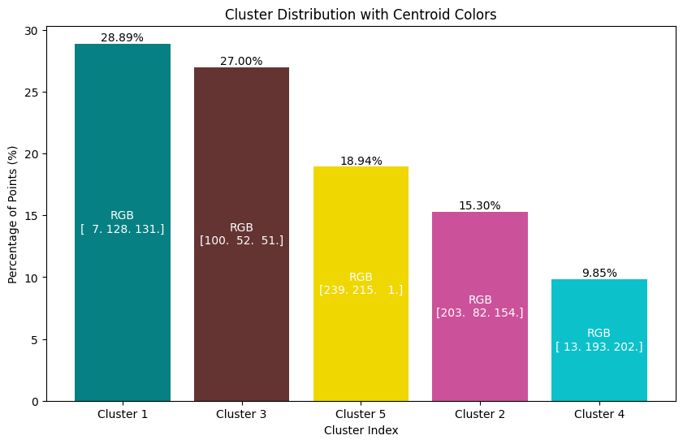

# Sample Starter Project

## Project Overview

This project implements the K-means clustering algorithm to segment images based on the similarity of colors using the RGB color space. It aims to classify each pixel into clusters, each represented by a centroid, which corresponds to the average color of the pixels in that cluster. This technique is useful for various applications including image compression, image analysis, and pattern recognition in digital images.

## Features

- **Image Loading**: Load images from your filesystem to be processed.
- **Color Clustering**: Implement K-means clustering to classify pixels based on their RGB color values.
- **Cluster Visualization**: Visualize the results to see how the image has been segmented into different color clusters.
- **Summary Statistics**: Generate and view summary statistics of the clustering, such as the number of pixels in each cluster and the centroid color of each cluster.

## Input


## Output


## Getting Started

### Prerequisites
- Docker
- Docker Compose
- Git (optional, for cloning the repository)

### Installation
1. **Clone the repository (optional):**
   ```bash
   git clone https://github.com/parthasarathydNU/gen-ai-coursework.git
   cd starter
   ```

2. **Build and run the application using Docker Compose:**
   ```bash
   docker-compose up --build
   ```

### File Structure
- `scripts/`: Contains Python scripts for data analysis.
- `results/`: Contains outputs from the scripts, including CSV files and plots.
- `Dockerfile`: Defines the Docker container setup.
- `docker-compose.yml`: Configures services, networks, and volumes for Docker.
- `requirements.txt`: Lists Python package dependencies.

## Usage
With Docker Compose, your application will be built and started by running the command mentioned in the Installation section. This will execute the scripts as configured in `docker-compose.yml`. You can edit this file to change which scripts are run or to adjust other settings such as port mapping and volume mounting.

## Contributing
Feel free to fork the repository and submit pull requests. You can also open an issue if you find any bugs or have suggestions for further improvements.

## License
This project is licensed under the MIT License - see the [LICENSE.md](LICENSE) file for details.

## Authors
- Dhruv Parthasarathy

## Acknowledgments
- Thanks to everyone who has contributed to the open-source packages used in this project.
